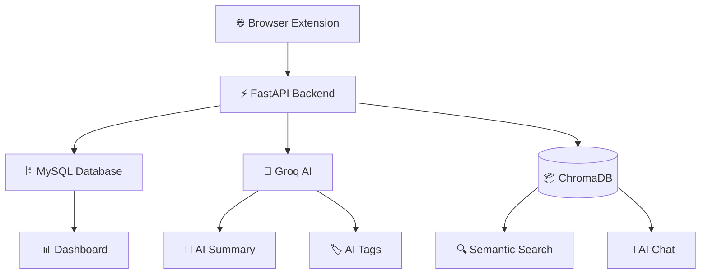
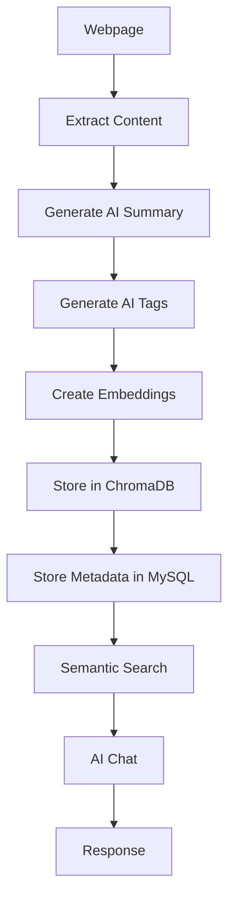

<div align="center">


# 🧠 Memora

### Browse Everything. Forget Nothing.


---


<br>


</div>

---

# 🚀 About Memora

**Memora** is an AI-powered Browser Memory Assistant that remembers everything you browse.

Instead of relying on browser history or bookmarks, Memora transforms webpages into intelligent memories that can be searched, summarized, organized, and queried using natural language.

Memora automatically:

- 📄 Captures webpage content
- 🧠 Generates AI summaries
- 🏷 Creates smart tags
- 🔍 Generates semantic embeddings
- 💾 Stores memories securely
- 💬 Lets you chat with your browsing history

Think of Memora as your **second brain for the internet**.

---

# ✨ Key Highlights

- 🧠 AI Generated Summaries
- 🔍 Semantic Search
- 💬 AI Chat
- ⭐ Favorite Memories
- 📊 Dashboard Analytics
- 📁 Collections
- 🏷 Smart Tags
- 📚 Reading Time Estimation
- 🌐 Domain Analytics
- 📈 Visit Tracking
- 🔐 JWT Authentication
- ⚡ FastAPI Backend
- 🚀 React Frontend
- 🤖 ChromaDB Vector Search

---

# 📸 Preview

> Screenshots coming soon...

```

Dashboard

Semantic Search

AI Chat

Collections

Analytics

```

---

# 📑 Table of Contents

- [🚀 About Memora](#-about-memora)
- [✨ Key Highlights](#-key-highlights)
- [🏗 Architecture](#-architecture)
- [⚙ Tech Stack](#-tech-stack)
- [📂 Project Structure](#-project-structure)
- [🧠 AI Workflow](#-ai-workflow)
- [📊 Dashboard Features](#-dashboard-features)
- [🔍 Semantic Search](#-semantic-search)
- [💬 AI Chat](#-ai-chat)
- [🔐 Authentication](#-authentication)
- [🚀 Installation](#-installation)
- [🛣 Future Roadmap](#-future-roadmap)
- [👨‍💻 Contributors](#-contributors)
- [📜 License](#-license)

---
# 🏗 Architecture



---

# 🧠 AI Workflow



---

# ⚙ Tech Stack

| Category | Technologies |
|-----------|--------------|
| Frontend | React, Vite, Axios, React Router |
| Backend | FastAPI, SQLAlchemy |
| Database | MySQL |
| Vector Database | ChromaDB |
| Authentication | JWT, Passlib, OAuth2 |
| AI | Groq Llama 3.3 70B |
| Embeddings | Sentence Transformers |
| Styling | CSS3 |
| Version Control | Git & GitHub |

---

# 📂 Project Structure

```text
memora_extension

│

├── backend

│   ├── app

│   │   ├── api

│   │   ├── core

│   │   ├── database

│   │   ├── models

│   │   ├── schemas

│   │   ├── services

│   │   ├── utils

│   │   └── main.py

│   │

│   ├── uploads

│   ├── chroma_db

│   ├── requirements.txt

│   └── .env

│

└── frontend

    ├── src

    │   ├── assets

    │   ├── components

    │   ├── context

    │   ├── hooks

    │   ├── pages

    │   ├── routes

    │   ├── services

    │   └── styles

    │

    ├── package.json

    └── vite.config.js
```

---

# 🚀 Core Features

## 🧠 AI Memory Engine

- Save webpages instantly

- AI generated summaries

- AI generated tags

- Reading time estimation

- Domain extraction

- Visit tracking

---

## 🔍 Semantic Search

Search naturally using AI.

Examples:

```
Which YouTube songs did I watch?

```

```
Show me FastAPI tutorials.

```

```
React authentication articles.

```

```
Git merge conflict solution.

```

Instead of keyword matching, Memora searches using vector embeddings.

---

## 💬 AI Chat

Chat directly with your saved memories.

Example:

```
What songs did I listen to yesterday?

```

```
Which websites did I visit about React?

```

```
Summarize my recent learning.

```

---

## ⭐ Favorites

- Mark important memories

- Quick access

- Personal knowledge base

---

## 📊 Dashboard

- Total Memories

- Favorite Memories

- Today's Memories

- Top Domains

- Top Tags

- Most Visited Pages

- AI Insight

- Recent Memories

---

## 📁 Collections

Organize memories into:

- Learning

- DSA

- AI

- College

- Internship

- Personal

---
# 🚀 Installation

## 1️⃣ Clone Repository

```bash
git clone https://github.com/snehal1805-dev/memora_extension.git

cd memora_extension
```

---

## 2️⃣ Backend Setup

```bash
cd backend

python -m venv venv
```

### Activate Virtual Environment

Windows

```bash
venv\Scripts\activate
```

Linux / macOS

```bash
source venv/bin/activate
```

Install dependencies

```bash
pip install -r requirements.txt
```

Create `.env`

```env
DB_USER=root
DB_PASSWORD=your_password
DB_HOST=localhost
DB_PORT=3306
DB_NAME=memora

SECRET_KEY=your_secret_key

GROQ_API_KEY=your_groq_api_key
```

Run Backend

```bash
uvicorn app.main:app --reload
```

---

## 3️⃣ Frontend Setup

```bash
cd frontend

npm install
```

Run Frontend

```bash
npm run dev
```

---

# 🔐 Authentication

Memora uses JWT Authentication.

Features

- Secure Signup
- Secure Login
- Password Hashing (bcrypt)
- JWT Access Tokens
- Protected Routes
- User-specific Memories

---

# 📡 API Overview

## Authentication

```
POST /auth/register

POST /auth/login
```

---

## Memory

```
POST /memory/save

GET /memory/all

GET /memory/recent

GET /memory/dashboard

GET /memory/favorites

PATCH /memory/update/{id}

PATCH /memory/favorite/{id}

DELETE /memory/delete/{id}
```

---

## AI

```
POST /memory/search

GET /memory/dashboard/insight
```

---

## Dashboard Analytics

```
GET /memory/dashboard/top-domains

GET /memory/dashboard/top-tags

GET /memory/dashboard/most-visited
```

---

# 📈 Future Roadmap

- Browser Extension Auto Save
- AI Recommendations
- PDF Memory
- OCR Support
- Voice Search
- Smart Collections
- Memory Timeline
- Chrome History Sync
- Firefox Support
- Edge Support
- Mobile Application
- AI Knowledge Graph
- Shared Collections
- Team Workspace
- Dark / Light Themes

---

# 🤝 Contributors

<table>
<tr>

<td align="center">

<a href="https://github.com/snehal1805-dev">


</a>

### Snehal Matole

🧠 Backend Development

⚡ FastAPI

🤖 AI Integration

🗄 Database Design

</td>

<td align="center">

<a href="https://github.com/YOUR_FRIEND_USERNAME">


</a>

### Samruddhi Pawde

🎨 Frontend Development

⚛ React

✨ UI / UX

💜 Dashboard Design

</td>

</tr>
</table>

---

# ⭐ Support

If you like this project,

Give it a ⭐ on GitHub.

It motivates us to build more amazing AI projects.

---

# 📜 License

This project is licensed under the **MIT License**.

---

<div align="center">

## 🧠 Memora

### Browse Everything. Forget Nothing.

Made with ❤️ by Snehal Matole & Samruddhi Pawde


</div>