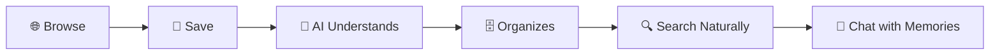
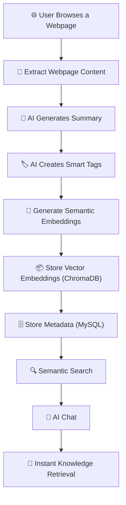
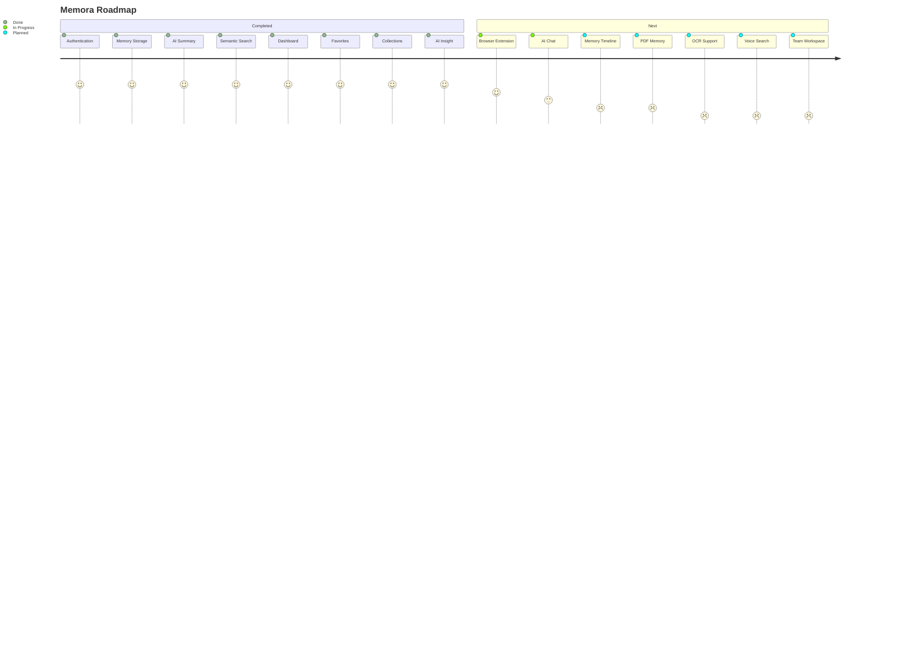

<div align="center">

# 🧠 Memora

### Browse Everything. Forget Nothing.


<br>


</div>

---

# 🚀 What is Memora?

Imagine browsing hundreds of webpages every week.

Interesting blogs.

YouTube tutorials.

Documentation.

GitHub repositories.

Research papers.

After a few days...

You remember **reading something**, but not **where**.

Searching browser history doesn't help.

Bookmarks become messy.

Google can't search *your own knowledge*.

### That's exactly why Memora exists.

Memora transforms your browsing history into an **AI searchable knowledge base.**

Every webpage becomes a memory.

Every memory becomes searchable.

Everything stays organized.

---

# 🎯 Who is Memora for?

<table>

<tr>

<td width="25%" align="center">

### 👨‍💻 Developers

Save documentation, GitHub repositories and tutorials.

</td>

<td width="25%" align="center">

### 🎓 Students

Never lose notes, articles or learning resources.

</td>

<td width="25%" align="center">

### 🔬 Researchers

Search months of collected information instantly.

</td>

<td width="25%" align="center">

### 🚀 Lifelong Learners

Build your own AI-powered second brain.

</td>

</tr>

</table>

---

# ❌ The Problem

```text
Bookmarks ❌

Browser History ❌

Thousands of Tabs ❌

Endless Searching ❌

Information Overload ❌
```

---

# ✅ The Memora Solution



---

# ✨ Core Experience

Instead of remembering...

> "Where did I read that article?"

You simply ask...

```

Show me the FastAPI tutorial
I saved last week.

```

or

```

Find React Authentication
documentation.

```

or

```

Which YouTube video taught
JWT Authentication?

```

Memora finds it instantly.

---

# 💡 Why Memora?

Instead of storing **bookmarks**,

Memora stores **knowledge.**

Instead of searching **URLs**,

Memora searches **meaning.**

Instead of remembering **websites**,

You remember **ideas.**

---

# 🧩 Core Features

| 🧠 AI Memory | 🔍 Semantic Search | 💬 AI Chat |
|-------------|--------------------|------------|
| AI summarizes every webpage | Search naturally using meaning | Ask questions from your saved memories |

| ⭐ Favorites | 📊 Dashboard | 📁 Collections |
|-------------|--------------|----------------|
| Save important memories | Personal browsing analytics | Organize memories by topic |

---
# ⚡ How Memora Works

Every webpage you visit goes through an intelligent AI pipeline.

Instead of simply storing links,

Memora transforms webpages into searchable knowledge.



---

# 🧠 AI Pipeline

<div align="center">

| Step | What Happens |
|------|---------------|
| 🌐 Capture | Memora captures webpage content |
| 🧠 Understand | AI reads and summarizes it |
| 🏷 Organize | Smart tags are automatically generated |
| 🧬 Embed | Content becomes vector embeddings |
| 💾 Store | Metadata and vectors are securely stored |
| 🔍 Retrieve | Search using natural language |
| 💬 Converse | Chat with your own browsing history |

</div>

---

# 🤖 AI Powered Features

<table>

<tr>

<td width="33%" align="center">

## 🧠 AI Summary

Automatically generates concise summaries for every webpage.

No need to reread long articles.

</td>

<td width="33%" align="center">

## 🏷 Smart Tags

Automatically classifies webpages into meaningful topics.

No manual organization.

</td>

<td width="33%" align="center">

## 🔍 Semantic Search

Find information by meaning instead of exact keywords.

</td>

</tr>

<tr>

<td width="33%" align="center">

## 💬 AI Chat

Talk naturally with your memories.

Ask questions exactly like ChatGPT.

</td>

<td width="33%" align="center">

## 📊 AI Insights

Understand your browsing habits through intelligent analytics.

</td>

<td width="33%" align="center">

## ⚡ Instant Retrieval

Retrieve relevant webpages within seconds.

</td>

</tr>

</table>

---

# 🎨 Dashboard at a Glance

> *(Replace these placeholders with screenshots later.)*

| Dashboard | Search |
|-----------|--------|
| 🖼 Dashboard Screenshot | 🖼 Semantic Search Screenshot |

<br>

| AI Chat | Collections |
|----------|-------------|
| 🖼 AI Chat Screenshot | 🖼 Collections Screenshot |

---

# 🌟 Why Memora is Different

<table>

<tr>

<th>Traditional Browser</th>

<th>Memora</th>

</tr>

<tr>

<td>

❌ Browser History

</td>

<td>

✅ AI Memory

</td>

</tr>

<tr>

<td>

❌ Endless Bookmarks

</td>

<td>

✅ Organized Knowledge

</td>

</tr>

<tr>

<td>

❌ Keyword Search

</td>

<td>

✅ Semantic Search

</td>

</tr>

<tr>

<td>

❌ Manual Organization

</td>

<td>

✅ AI Generated Tags

</td>

</tr>

<tr>

<td>

❌ Search URLs

</td>

<td>

✅ Search Ideas

</td>

</tr>

<tr>

<td>

❌ Static History

</td>

<td>

✅ Interactive AI Chat

</td>

</tr>

</table>

---

# 💜 Built for Knowledge Workers

Whether you're

- 👨‍💻 Building software
- 🎓 Studying for exams
- 📚 Reading research papers
- 🎥 Watching tutorials
- 🧠 Learning AI
- 🚀 Exploring new technologies

Memora makes sure you never lose valuable knowledge again.

---

# 🚀 Getting Started

Clone the repository

```bash
git clone https://github.com/snehal1805-dev/memora_extension.git
```

Move into the project

```bash
cd memora_extension
```

Backend

```bash
cd backend
pip install -r requirements.txt
uvicorn app.main:app --reload
```

Frontend

```bash
cd frontend
npm install
npm run dev
```

Open your browser

```
http://localhost:5173
```

---

# 🛣 Roadmap



---

# 🌍 Vision

We believe the future of browsing isn't about saving **webpages**.

It's about remembering **knowledge**.

Memora aims to become an intelligent memory layer for the browser—one place where everything you learn, watch, read, and discover is organized, searchable, and always available.

---

# 🤝 Meet the Builders

<div align="center">

<table>

<tr>

<td align="center" width="50%">

<a href="https://github.com/snehal1805-dev">


</a>

### 🧠 Snehal Matole

**Backend • AI • Architecture**

FastAPI • Vector Search • LLM Integration

</td>

<td align="center" width="50%">

<a href="https://github.com/YOUR_FRIEND_USERNAME">


</a>

### 🎨 Samruddhi Pawde

**Frontend • UI/UX**

React • Dashboard • User Experience

</td>

</tr>

</table>

</div>

> Replace `YOUR_FRIEND_USERNAME` with Samruddhi's GitHub username.

---

# 💜 Built With

<div align="center">

FastAPI • React • MySQL • ChromaDB • Groq AI • JWT • SQLAlchemy

</div>

---

<div align="center">

# ⭐ If you like Memora...

Give this repository a ⭐

It helps us grow and motivates us to build even better AI tools.

<br>

### 🧠 Memora

### Browse Everything. Forget Nothing.


</div>